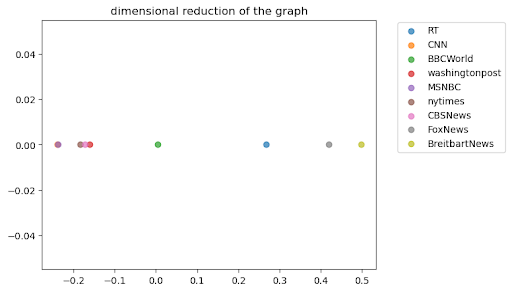

# Political Polarization of Major News Networks on Twitter

## Abstract
We will construct a geometric definition of the political spectrum of major US news outlets through an unsupervised approach. We collected the retweeters of news outlets in questions, scraped the hashtags used in their individual timelines and cross-reference it with the hasanalyze the users who interact with the Twitter accounts of various popular news networks to compare their alignment across the U.S. political spectrum. We will be collecting hashtags used in the users' own timelines and cross reference it with the hashtags used during election period to classify their political stance as well as create a graph analysis between the news networks as a whole. Through this, we demonstrate the location where each news network lies on the U.S. political spectrum and how they lie relative in hashtag vector space to one another.

## Introduction
The major television news networks have always played a key role in delivering important news and information to the public in a predictable and concise manner tailored to their viewers. As a result of this conformation to the preferences of their respective audiences, many news networks have developed a tendency to report news with a bias in various aspects of reporting; most notably, the most prevalent defining characteristic of a news network is its political affiliation. This often leads to skewed information motivated by viewership and rating results.

An example of the bipartisan split in television news networks can be seen in the contrast between CNN and Fox news. CNN is widely considered to be a left-leaning or democratic organization, while Fox is catered to a republican audience. This polarization of news is often criticized as furthering the tunnel vision in viewers by only showing them what they already agree with. Similar to “echo chambers” in The Spread of Misinformation Online, Vicario et al.[1], this action of reporting biased news creates isolated communities of viewers where information is often circulated within their own groups. 

Although most news media outlets already have a pretty well defined political alignment, our analysis will involve further verifying this classification and comparing these news stations on different spectrums other than political affiliation. Our goal in this project is to quantify the political inclination (pro-democrat vs pro-republic) of eight news stations. In other words, we want to construct a political spectrum and see how these new stations fall on the spectrum.

## Data
### An overview of followers and traditionally believed politcal alignment

| News/Media Outlet | Number of Followers | Traditional Political Alignment |
|-------------------|---------------------|---------------------------------|
| FoxNews           | 20M                 | Towards Right                   |
| BBCWorld          | 30.9M               | Middle                          |
| MSNBC             | 4M                  | Middle Left                     |
| CNN               | 52.6M               | Middle Left                     |
| Washingtonpost    | 17.4M               | Towards Left                    |
| CBSNews           | 8M                  | Middle Left                     |
| nytimes           | 49.2M               | Towards Left                    |
| RT_America        | 367.5K              | Unknown                         |
| BreitBartNews     | 1.4M                | Far Right                       |

Data sourced from https://guides.lib.umich.edu/c.php?g=637508&p=4462444

### Collection
Through use of the Twitter API, we are able to gather any data that was made publicly available on the Twitter platform. Per the terms of this API, we are unable to access any tweet that is protected by a private account or has been deleted. Although we are collecting tweet data from individual users, we will only be analyzing aggregated values from hashtags and will not be releasing any individual data points.

The eight news stations we chose were BBCWorld, BreitbartNews, CBS, CNN, FoxNews, MSNBC, RT_America, nytimes, and washingtonpost. We decided on these accounts as they are all relatively well-known and we wanted to have a sample of media outlets that were distributed along the political spectrum and therefore chose outlets that are left, neutral and right leaning. Since the goal of our project is to analyze the users that actively interact with each news station, we needed to gather a sizable sample of tweets to quantify the general trend of political affiliation. Our steps were as follows: sample the most recent tweets from each news outlet, gather all retweeters in each tweet, and then finally examine the retweeters by collecting the counts of hashtags used in each retweeter’s timeline.

The main portion of our data collection process was gathering the users that actively interact with the Twitter accounts of major news stations. We looked at the most recent 100 posts from each news outlet and collected every retweet and subsequently every user who retweeted the post. After collecting these users, we randomly sampled 500 users from each news station and gathered the most recent 1000 tweets from each user’s timeline. If a user did not have 1000 tweets, we simply took their entire timeline. 

From these tweets, we collected every hashtag used and took down the occurrence of each hashtag. To account for minor variations in hashtag spelling and syntax, we stored each hashtag in its lowercase form. Each news outlet now has a list of hashtags along with a mapping of the respective number of times used in a tweet. This information will be used as a hashtag vector in our graph analysis elaborated further in the methodology section.

Our definition of a user that "actively interacts" with a news outlet is someone who has retweeted one of the outlet's tweets in the past 3 months. Although it may have been easier to collect users from the news outlets' follower lists, we wanted to ensure our users analyzed were active on their Twitter so that we can analyze how they interact with current political accounts and tweets.

### Exploratory Data Analysis
As the end goal of our project is to utilize hashtag usage for comparison of news outlets, we wanted to begin by looking at the most commonly used hashtags relative to each news outlet. We believed that the most noticeable difference in hashtag trends would be politically motivated as the traditional consensus is that these eight news outlets all have some sort of political affiliation or bias in their reporting, attracting users of the same political alignment.

| Hashtags only found in left | Hashtags only found in right |
|-----------------------------|------------------------------|
| Blacklivesmatter            | Oann                         |
| BidenHarris2020             | Antifa                       |
| ConvictTrump                | Maga                         |
| wearamask                   | pelosilovestrump             |
|                             | stopthesteal                 |
|                             | trump2020                    |
|                             | americafirst                 |
|                             | bidenlied                    |
|                             | bidencheated                 |

To do this, we looked to aggregate hashtag frequencies and compare the distributions across each news outlet. There were a few common hashtags found across all eight news stations such as variations of “covid-19” and “trump”. These words have relatively neutral meaning in terms of political leaning and therefore looked into the effect of removing them in our methodology. 

| Shared hashtags with differing connotations |
|---------------------------------------------|
| covid19                                     |
| breaking                                    |
| coronavirus                                 |
| trump                                       |
| fbi                                         |
| election2020                                |
| biden                                       |
| china                                       |
| georgia                                     |

Our first visualization was a horizontal bar chart designed to display the most popular hashtags used in each news outlet. We hypothesized that there will be a quantifiable difference in the hashtags used by users of each news outlet due to the difference in population of their active users. A brief glimpse into the figures below shows that there is indeed a noticeable difference in hashtag usage between users of each news outlet, more specifically with news outlets of differing political alignments. We found that politically charged words are the most prevalent separation between each collection of hashtags.

## Related Literature
Predicting the political alignment of users on social media has always been a topic of interest for many scholars and institutions to research. As social media grows in popularity, more and more users will begin to upload information about their personal lives, and oftentimes their political beliefs, into the public domain for others to interact with. With this ever growing plethora of information, many new approaches have been developed to better understand the characteristics of US voters as opposed to traditional census and polling practices. While our project focuses exclusively on analyzing the hashtag usage of our gathered users compared to an existing dataset of election related tweets, there are many other publications that investigate a user’s actions in more detail.

In <em>Predicting the Political Alignment of Twitter Users</em>, Conover, Goncalves, Ratkiewics, Flammini and Menczer demonstrated several implementations of predicting the political stance of a Twitter user based on their tweets. The paper utilized the hashtags and tweet text to build a machine learning model for predicting a user’s political stance. In a SVM model, the researchers were able to achieve a higher accuracy through metadata on hashtags versus tweet text. This coinsigns with our hypothesis that hashtags will provide the best viable separation in how users display their political stance. Their analysis also showed clear clusters that represented the two respective political groups, republicans and democrats. Whereas the researchers defined the political stance of hashtags through Latent Semantic Analysis to discover political affiliation of hashtags, our group will be plotting the hashtag vectors of each news outlet as a whole to demonstrate the differences of news outlets in terms of vector space.

# Methodology
## Overall Process
We are adopting an unsupervised approach towards quantifying the concept of political spectrum. In short, we define the political spectrum to be the 1-D Euclidean space where the news station lies and where outlets with similar political inclination would be close to one another. To transform the news stations into said space, we plan to construct a complete graph among the news stations - where the nodes are our news stations in question and the edges are weighted by our pairwise similarity (to be defined in the next paragraph) measure - and maps the graph onto the euclidean space through spectral embedding using Laplacian EigenMap. The resultant plot - of the nodes lying in the euclidean space  in a fashion relative to their pairwise similarity - would be the main answer to our research question. 

## Defining Pairwise Similarity for Graph
We formally define the concept of similarity between two news stations to be the

  

are feature vectors for the two news stations. The feature space of the vector is the hashtags used in tweets in the election dataset and the value for each feature is the normalized/unnormalized (dependent on configuration) number of occurrences of each hashtag in the user timeline dataset for each news outlet. Aside from the aforementioned optional normalization of count of occurrences, other configuration of the feature space includes removing overly neutral hashtags based on a set of pre-defined hashtags (such as Covid-19, coronavirus) in an attempt to remove overwhelming hashtags with overly neutral net implication. This method is our attempt to capture the similarity in political view between pairs of news stations in an unsupervised approach. 

  

## Embedding Graph
The method we chose for graph embedding is Laplacian Eigenmap. The minimization goal of the method, which is

  

  

(y denotes euclidean coordinate of a node and Wij denotes the edge weight between the two nodes), rewards short pairwise euclidean distance based on edge weight. This largely coincides with our definition of a political spectrum and therefore is a sensible option for embedding. 

To recap we define the position of news stations in a political spectrum as their relative position in euclidean space embedded from a graph that stores pairwise similarity, characterized as a function of two vectors of hashtags under the same feature space, as edge weights between vertices. There are a few advantages and disadvantages ostensible upon its conception. 

# Results
Through reducing the graph to a 1-D euclidean space, we can observe the pairwise similarity between the news stations. Again, it is important to note that the plot only captures the relative position of the news stations from the higher dimension euclidean space that they reside in. However, the relative distance between the news stations are still observable from the plot.

Fig 2.1 presents the result for our chosen similarity parameter - normalized vector, removed certain hashtags and case insensitive hashtag counting. The resultant order on the spectrum from left to right is CNN and MSNBC (largely overlapped), NYT, CBS, Washington, BBC, RT, FOX, Breitbart. 

# Discussion
In general, the main takeaway is that the aggregation of relative pairwise distance does indeed lead to a resultant overall order of data points that fits our expectation, that is - the likes of CNN on one end of spectrum and the likes of Breitbart News on the other. Taking a look back at the similarities of the news stations in Fig. 2.1, CNN, MSNBC, the NewYorkTimes, CBSNews, and the Washington Post fit in their own cluster. BBCWorld and RTAmerica are distant from the other news stations but considering the small similarity between them, RTAmerica fits closer to the cluster of FoxNews and BreitbartNews. These clusters fit the convention of the political leanings of the news stations. 

Fig 3.1 Media bias Rating from AllSides
Fig 3.2 Ideological placement from Pew Research Center

 

To contextualize the conventional conception of political leaning of news outlets, we compare our results to existing results from other researches on the same topic. Both the media bias rating from AllSides and the ideological placement from Pew Research Center utilizes heuristic approaches such as surveys and editorial reviews in their methodology. The order of news stations displayed in our spectrum is very similar to that of the two previous researches mentioned above, with CNN and MSNBC on one extreme and Fox and Breitbart on the other. 

However, the difference between these findings and the conventional wisdom is that these groupings were based off of the viewer bases of the news stations. Another thing to note is the similarity in what is considered to be left leaning news stations to be a lot more tighter than those considered to be right leaning news stations. This could point to a difference between the general fields of thought or further divisions within the right side of the political spectrum but could be caused by the limited sample of news stations observed.

Additionally, aside from our chosen set of parameters, we also performed a grid search on combinations of other parameters for the similarity function. The findings made above are still present with little variation when testing other combinations of the parameters for the function. While there lies variation in the relative distances, the clusterings and ordering of are present in all of the combinations available. We believe that this low variance in result serves as evidence to the robustness of this method of quantifying the political leanings and underlying political spectrum.

The distinction that the viewer base reflects the political leanings of the news networks they follow brings further questions. This correlation of political division needs further analysis and a deeper dive into the dynamics and understanding of politics. At this point, there seems to be a relationship between the political bias of viewers and that of the content and framing that is present in the news presented by the news stations; whether that be the viewers influencing the content being presented or the viewers influenced by the bias in the news itself but most likely something much more nuanced and complex. 

# Conclusions
Throughout this paper, we observed the political leaning of several news stations observed through the lens of their viewer base. From this we managed to capture that the viewer base holds a tight correlation with the political leaning of the news stations they subscribe to. There is a slight discrepancy between the findings and what is expected but within reason of variance. While this finding may not be surprising for someone who is aware of the current political climate in America, it is further statistical evidence to the division that the country is facing. While the direction of the relationship between news stations and their viewer base was not explored, this serves as a starting point for the potential importance of news stations as a key player in influencing political thought and conversation. Bias in news continues to be an issue in providing factual information to the general public.

